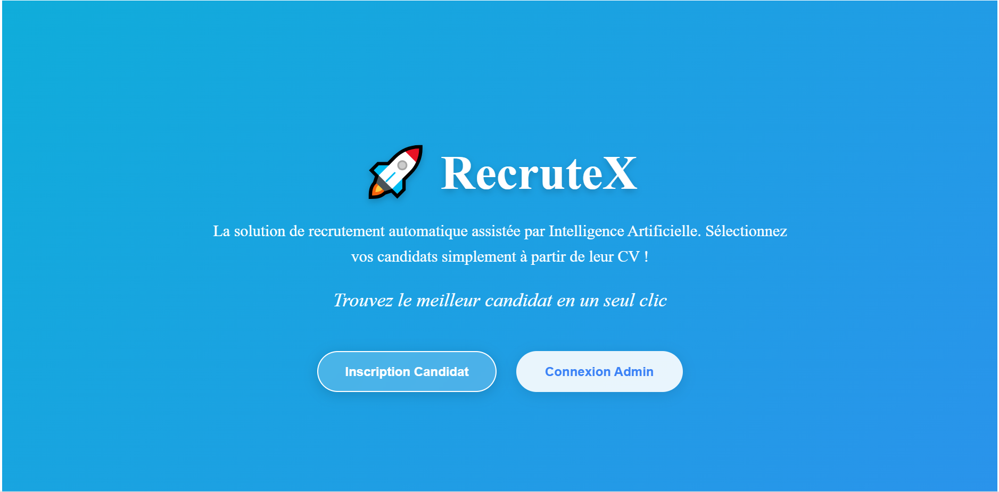
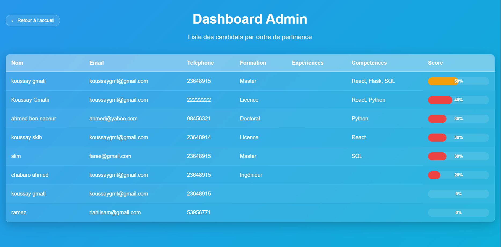
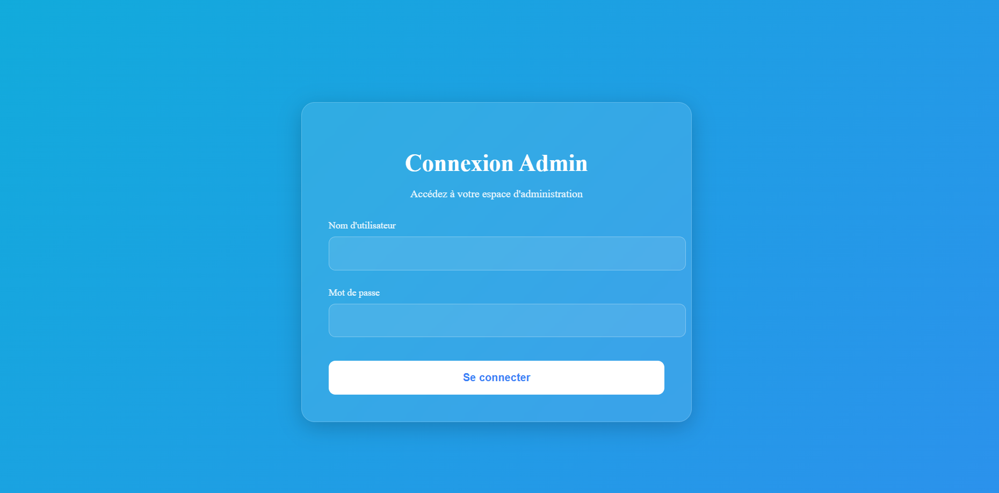
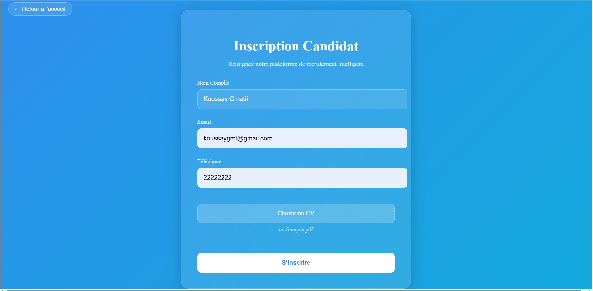

RecruteX

🚀 RecruteX est une application intelligente de gestion du recrutement (ATS) qui automatise l’analyse des CV et aide les recruteurs à sélectionner les meilleurs candidats rapidement et efficacement.

🎯 Objectif

Offrir une solution moderne et automatisée pour :

Collecter et centraliser les candidatures,

Analyser les CV via des algorithmes d’IA,

Générer un score de pertinence basé sur l’expérience, les compétences et la formation,

Aider les recruteurs à identifier rapidement les meilleurs profils.

✨ Fonctionnalités principales

Portail candidat : inscription simple et dépôt de CV.

Analyse par IA : extraction des informations clés (nom, email, téléphone, expériences, compétences).

Scoring automatique : calcul intelligent de la pertinence du CV selon des critères configurables.

Dashboard recruteur : classement des candidats par score, recherche et filtres.

Interface claire et moderne : design simple avec CSS.

🛠️ Compétences & Stack utilisées
🔹 Développement

Frontend : React + CSS simple (UI moderne, responsive).

Backend : Flask (Python).

Base de données : MySQL (gestion des candidats, scores et profils).

🔹 Intelligence Artificielle & Analyse

Parsing CV : extraction automatique des informations depuis PDF/DOCX.

NLP (traitement du langage naturel) : spaCy / Transformers pour identifier les compétences et expériences.

Scoring IA : algorithme qui pondère expérience, stack technique, mots-clés et diplômes.

👥 Utilisateurs ciblés

Entreprises et RH : simplifier et accélérer le recrutement.

Cabinets de recrutement : améliorer la qualité de sélection.

Candidats : valoriser leur CV et compétences.

🌍 Vision

RecruteX ambitionne de devenir un outil de référence en recrutement intelligent, combinant :

Technologie IA (analyse de CV et scoring),

Simplicité d’utilisation (interface fluide, claire et efficace),

Gain de temps pour les recruteurs et meilleure visibilité pour les candidats.

🖼️ Captures d’écran

1. Page d’accueil

2. Dashboard Admin

3. Fiche Candidat

4. Inscription Candidat

📌 À propos

Développé par Koussay Gmati

🔹 Passionné par le développement web (React, Flask, CSS, MySQL)

🔹 Spécialisé en IA appliquée au recrutement et analyse de données

🔹 Motivé par l’innovation digitale RH